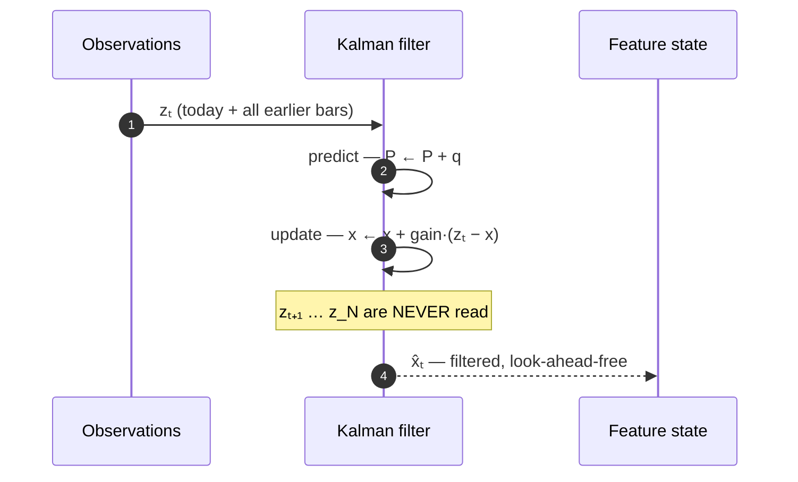
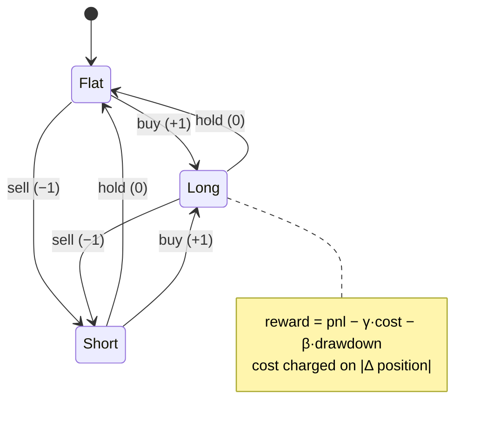

<h1 align="center">Crucible</h1>

<p align="center"><i>An extraordinary Sharpe-12 gold-trading result, put through the crucible of a strictly causal, leakage-free rebuild.</i></p>

<p align="center">
  
  
  
  
  
  
</p>

> A faithful rebuild of **"Kalman-Enhanced Deep Reinforcement Learning for
> Noise-Resilient Algorithmic Trading"** (IJACSA 16(11), 2025) — the paper claims a
> **Sharpe of 12.10** on hourly gold by denoising prices with a Kalman filter before
> training DQN / PPO / Recurrent-PPO agents. This repo rebuilds that method under
> conditions where **look-ahead is structurally impossible**, and asks one question:
> **do the gains survive?**
>
> *Crucible*: the vessel where a claim is held under heat until only what's genuine
> survives. Here the heat is causality — a forward-only filter, train-only scaling,
> raw-price PnL — and the Sharpe-12 does not make it out.

---

## Highlights

- **A Sharpe of ~12 with a sub-1% drawdown over 8 years is the number to distrust.**
  This repo treats it as a bug to trace, not a win to report — and traces it.
- **The Kalman filter is unit-*proven* causal** ([`kdrl/kalman.py`](kdrl/kalman.py)):
  perturbing a *future* price leaves every *past* filtered value byte-identical
  ([`tests/test_kalman_causal.py`](tests/test_kalman_causal.py)). No RTS smoother, ever.
- **The headline does not survive.** Under a leakage-free setup the best run is
  **RPPO+Kalman at Sharpe −0.67** — versus the paper's 12.10. Every agent trails
  passive buy-and-hold.
- **The paper contradicts itself.** Its results table swaps PPO↔RPPO against its own
  prose, its data is described as both *hourly* and *resampled to daily*, and a
  **2% annualized volatility** on a >15%-vol asset is mathematically impossible without
  timing every move — see [Why a Sharpe of 12 is a red flag](#why-a-sharpe-of-12-is-a-red-flag).
- **The Kalman step is real but modest and mixed** — it helps the policy-gradient
  agents and *hurts* DQN. Useful denoising; not a free Sharpe-12 machine.

## The claim under test

> Kili, Raouyane, Rachdi & Bellafkih (2025), IJACSA **16(11)**, Paper 81 ·
> [official PDF](https://thesai.org/Downloads/Volume16No11/Paper_81-Kalman_Enhanced_Deep_Reinforcement_Learning_for_Noise_Resilient_Algorithmic_Trading.pdf) ·
> [abstract](https://thesai.org/Publications/ViewPaper?Volume=16&Issue=11&Code=IJACSA&SerialNo=81)

| Paper's headline (PPO + Kalman) | vs raw PPO | claimed effect |
|---|---|---|
| **80.21%** cumulative · **27.1%** CAGR | 8.70% · 3.46% | up to **822%** return gain |
| **Sharpe 12.10** | Sharpe 0.45 | up to **29×** Sharpe |
| Max drawdown **−0.48%** | −12.52% | **88–96%** drawdown cut |

The most common way a number like this appears is **look-ahead / data leakage** — so the
whole repo is built so that it *cannot* happen, and then re-measures.

## Results (out-of-sample)

<!-- RESULTS -->
XAU/USD · H1 · **47,302 bars** (2017-01-02 → 2024-12-31) · chronological **80/20** split ·
z-scored on **train stats only** · **60k** steps/agent · single seed · 0.01% commission ·
`reward = pnl − cost − β·drawdown` · Sharpe ann. √6048.

| Agent | Kalman | Cum. Return | CAGR | Sharpe | Max DD | Vol |
|---|---|---:|---:|---:|---:|---:|
| DQN  | no       | −12.50% | −8.19%  | −0.655 | −18.45% | 11.95% |
| DQN  | **yes**  | −20.55% | −13.69% | −1.297 | −22.67% | 10.89% |
| PPO  | no       | −47.77% | −34.01% | −3.387 | −49.45% | 12.06% |
| PPO  | **yes**  | −20.53% | −13.68% | −1.155 | −27.44% | 12.10% |
| RPPO | no       | −30.54% | −20.80% | −1.965 | −34.57% | 11.53% |
| RPPO | **yes**  | −9.10%  | −5.92%  | −0.667 | −14.06% |  8.60% |

Passive **buy & hold** over the same window: **+34.84%**, Sharpe **1.50** (gold rallied
hard through 2023–2024). Full table: [`results/comparison.md`](results/comparison.md).
<!-- /RESULTS -->

**What this shows.** The paper's Sharpe **12.10** becomes **−0.67** under a strictly
causal filter and a clean split — the classic signature of look-ahead collapsing once
it's removed. The Kalman step is a *real but mixed* effect: it helps the policy-gradient
agents (PPO −3.39 → −1.16; RPPO −1.97 → −0.67) and **hurts** DQN (−0.66 → −1.30).

## Why a Sharpe of 12 is a red flag

The strongest evidence needs no compute — it's in the paper's own pages:

| The paper reports | The problem |
|---|---|
| +80% return at **1.49–2.10%** annualized volatility | Gold's own volatility is **>15%** (the paper says so). A 100%-deployed long/short strategy **cannot** show ⅐ of the asset's volatility *and* double its return without catching every move the right way — i.e. **future knowledge**. |
| Max drawdown **−0.48%**, **82%** win rate, **100%** winning months | Joint overfit / leakage signature over a 2-year window. |
| Table I: 80.21% / Sharpe 12.10 → **RPPO**+Kalman | …but the abstract and discussion attribute 80.21% / Sharpe 12.10 to **PPO**. Sortino, Calmar and Recovery-factor are swapped the same way. **Table and prose disagree on which algorithm won.** |
| N = 47,304 **hourly** bars | …yet the same section says data was *"re-sampled to **daily** frequency,"* then reports a *"**621-day** evaluation period."* The paper can't hold its own sampling rate fixed. |

None of these require re-running anything — the headline is unreproducible *and*
internally inconsistent. This repo's job is to make the causal version measurable.

## Method

One canonical dataset → one **causal** Kalman pass (toggleable) → one feature builder →
one leakage-safe split → one environment → three agents → one metrics function. The
*only* thing that changes between a Kalman and a non-Kalman run is **what the agent sees**.

```mermaid
flowchart LR
    SRC["Dukascopy<br/>XAU/USD · H1"]:::src
    CSV[("xauusd_h1.csv<br/>47,302 bars · committed")]:::data
    K["causal Kalman filter<br/>(on / off toggle)"]:::core
    F["22 features<br/>SMA · EMA · MACD · RSI · BB · ATR · …"]:::core
    SP["chronological 80/20<br/>z-score on TRAIN only"]:::dec
    ENV["TradingEnv<br/>short / flat / long"]:::eng
    AG["DQN · PPO · RPPO"]:::eng
    M[("out-of-sample<br/>metrics")]:::data
    SRC --> CSV --> K --> F --> SP --> ENV --> AG --> M
    classDef src fill:#eef2ff,stroke:#6366f1,color:#1e1b4b;
    classDef data fill:#ecfdf5,stroke:#10b981,color:#064e3b;
    classDef core fill:#fff7ed,stroke:#f59e0b,color:#7c2d12;
    classDef dec fill:#fef2f2,stroke:#ef4444,color:#7f1d1d;
    classDef eng fill:#faf5ff,stroke:#a855f7,color:#581c87;
```



### The denoiser — a strictly causal Kalman filter

A local-level (random-walk + noise) state-space model per price channel. The estimate at
time `t` is a running blend of past estimate and *today's* observation — **tomorrow's
price is never read.**

```
state:        xₜ = xₜ₋₁ + wₜ ,   wₜ ~ N(0, q)     # latent "true" price
observation:  zₜ = xₜ  + vₜ ,   vₜ ~ N(0, r)     # noisy market price

predict:      P ← P + q
update:       K ← P / (P + r)                    # Kalman gain
              x ← x + K·(zₜ − x)                  # zₜ = today only
              P ← (1 − K)·P
```



The smoothing strength is the ratio `q/r` (here `1e-4 / 1e-2`); a small ratio denoises
harder. PnL is **always** marked on the **raw** close — denoising changes what the agent
*observes*, never the price it *trades*.

### The environment — discrete long/flat/short



At step `t` the agent sees the feature vector built from data **up to `t`**, picks a target
position, and earns the return realised from `t → t+1` on the raw close — causal by
construction ([`kdrl/env.py`](kdrl/env.py)).

### Method at a glance

| | |
|---|---|
| Data | XAU/USD, H1, **47,302 bars** (2017-01-02 → 2024-12-31), Dukascopy |
| Denoising | causal local-level Kalman filter on OHLC ([`kdrl/kalman.py`](kdrl/kalman.py)) |
| State | 22 hand-written features + current position ([`kdrl/features.py`](kdrl/features.py)) |
| Agents | DQN, PPO (stable-baselines3), Recurrent-PPO (sb3-contrib) ([`kdrl/agents.py`](kdrl/agents.py)) |
| Env | 3 actions; `reward = pnl − cost − β·drawdown`; 0.01% commission ([`kdrl/env.py`](kdrl/env.py)) |
| Split | chronological 80/20, train-only scaling ([`kdrl/experiment.py`](kdrl/experiment.py)) |
| Metrics | cumulative, CAGR, Sharpe (ann. √6048), max drawdown, volatility ([`kdrl/metrics.py`](kdrl/metrics.py)) |

## What was held causal (leakage controls)

| Risk of leakage | How this repo blocks it |
|---|---|
| Kalman *smoother* using future bars | forward **filter** only — no RTS pass; unit-proven byte-identical past under future perturbation |
| Indicators peeking ahead | every feature is `rolling`/`ewm` (backward-looking), hand-written, no centred windows |
| Test statistics leaking into scaling | z-score uses **train mean/std only** ([`experiment.py`](kdrl/experiment.py)) |
| Filtering across the split boundary | filter is causal, so filtering the full series then splitting cannot contaminate test |
| Trading the denoised price | PnL marked on the **raw** close — denoising only changes the observation |

## Faithful where it counts — and where it diverges

| | Paper | This repo |
|---|---|---|
| Filter | forward Kalman (Eq. 11–12 / 16–20) | forward Kalman, **unit-proven causal** |
| State-space | multivariate, F = H = identity | per-channel local-level (equivalent) |
| Agents | DQN · PPO · RPPO | DQN · PPO · RPPO |
| Action / sizing | {−1, 0, +1}, 100% capital | identical |
| Reward | `α·ret − β·DD − γ·cost + δ·stability` | `pnl − γ·cost − β·DD` (no stability term) |
| Split | 70/30 | **80/20** |
| Training | **500,000** steps, [512,512,256,128] nets | 60k steps, SB3-default nets |
| Costs | commission + spread + impact + slippage | commission only (more lenient) |

The training-budget and network-size gaps mean the *absolute* losses here are partly
undertraining — but the **qualitative** gap to Sharpe 12 is structural, not a budget
artifact (the paper's own 2%-volatility claim can't be reached by training harder).
Honest framing kept throughout.

## Repository layout

```
kdrl/        kalman.py · features.py · env.py · agents.py · evaluate.py · metrics.py · experiment.py
data/        get_data.py (Dukascopy) + xauusd_h1.csv (47,302 bars, committed)
tests/       test_kalman_causal.py (the causality proof) · test_pipeline.py
train.py · run_all.py · results/  (comparison.csv + comparison.md)
```

## Quick start

```powershell
# Windows · Python 3.12 — from the repo root
py -3.12 -m venv .venv ; .venv\Scripts\activate
pip install -r requirements.txt

python data/get_data.py            # pull XAU/USD H1 -> data/xauusd_h1.csv
python -m pytest tests -q          # 8 passing (incl. the causality proof)
python run_all.py --timesteps 100000   # full DQN/PPO/RPPO × Kalman matrix
```

<details>
<summary>Run a single experiment, or change the knobs</summary>

```bash
# one agent, Kalman on:
python train.py --algo ppo --kalman --timesteps 100000

# the matrix for one agent only, fixed seed:
python run_all.py --algos rppo --seed 0 --timesteps 100000
```

`run_experiment(...)` in [`kdrl/experiment.py`](kdrl/experiment.py) exposes `split`,
`cost`, `beta`, and the Kalman `q`/`r` if you want to sweep them.
</details>

## Correctness & reproducibility

- **8 tests** ([`tests/`](tests/)): the causality proof (future perturbation ⇒ identical
  past), filter denoises, 22-feature shape is NaN-free with/without Kalman, metric
  formulas on known values, environment steps & terminates, always-long profits on an uptrend.
- **Committed, hashed data** — `data/xauusd_h1.csv`,
  SHA-256 `ebb164a5…aad7d`; fixed UTC range, no `datetime.now()` / relative windows.
- One pipeline ([`experiment.py`](kdrl/experiment.py)) drives every run, so the **only**
  variable between Kalman and non-Kalman is the observation.

## Honest note on AI tools

Built with an AI coding assistant. It was useful for scaffolding the SB3 pipeline — and
kept honest by primary sources and by the instinct that drives the whole repo: a result
that looks too good (here, Sharpe 12) is a **bug to be traced**, not a win to be reported.
That instinct is what surfaced the paper's internal table/prose contradictions and the
impossible-volatility tell.

## License

[MIT](LICENSE) © 2026 Abhishek Kumar Gupta

---

<p align="center"><sub><b>Crucible</b> — built with ❤️ and strict causality by <a href="https://github.com/guptabhishekumar">Abhishek Gupta</a></sub></p>
